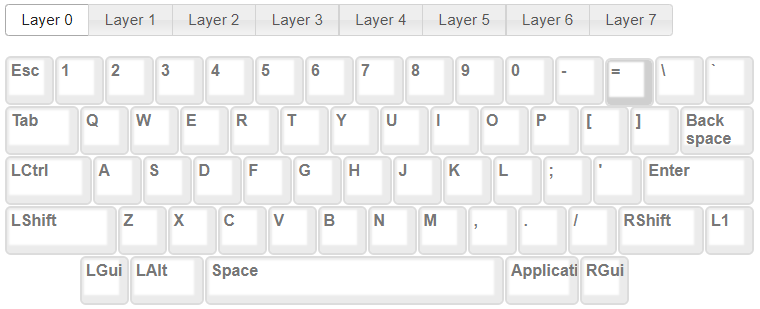
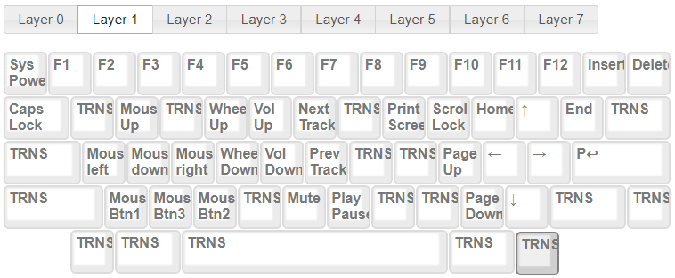

# HHKB Custom Layout
My own keyboard customization layout  

_26/07/2025:  I'm back using default layout though_

## info: 
Mac: 
- Layout editor:  [source](https://www.tmk-kbd.com/tmk_keyboard/editor/unimap/?hhkb)
- Flash with `dfu-programmer`:  [source](https://dailytechnology.net/programming/2021/09/22/remapping-hasu-controller)

Windows: 
- Layout editor: [source](http://www.tmk-kbd.com/tmk_keyboard/editor/unimap/?hhkb)
- Flash with FLIP: [source](https://www.softpedia.com/get/Programming/Other-Programming-Files/Atmel-Flip.shtml)

## Layout
### Layer 0

### Layer 1

